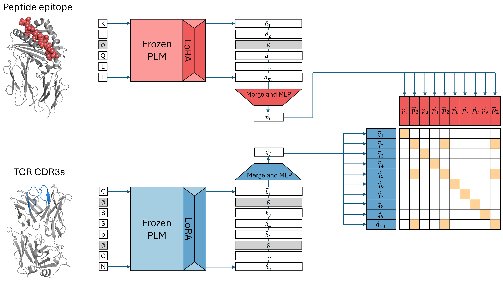

# ImmuneCLIP
Code for paper "Sequence-based TCR-Peptide Representations Using Cross-Epitope Contrastive Fine-tuning of Protein Language Models." [[preprint](https://www.biorxiv.org/content/10.1101/2024.10.25.619698v1)]

🚧 This repository is under active construction. 🚧

## Model Components:


* Epitope Encoder
  * PEFT-adapted Protein Language Models (e.g. ESM-2, ESM-3)
  * Default: Using LoRA (rank = 8) on last 8 transformer layers
  * Projection layer: FC linear layer (dim $d_{e} \rightarrow d_p$)
    * $d_{e}$ is the original PLM dimension, $d_p$ is the projection dimension

* Recepter Encoder
  * PEFT-adapted Protein Language Models (e.g. ESM-2, ESM-3) **or** BCR/TCR Language Models (e.g. AbLang, TCR-BERT, etc.)
  * Default: Using LoRA (rank = 8) on last 4 transformer layers
  * Projection layer: FC linear layer (dim $d_{r} \rightarrow d_p$)
    * $d_{r}$ is the original receptor LM dimension, $d_p$ is the projection dimension

## Dataset:
* MixTCRPred Dataset ([paper](https://github.com/GfellerLab/MixTCRpred/tree/main))
  * Contains curated mixture of TCR-pMHC sequence data from IEDB, VDJdb, 10x Genomics, and McPAS-TCR


## CLI:
### Environment Variables
To run this application, set the following environment variables
```
WANDB_OUTPUT_DIR=<path to output dir>
```

Additionally, if training on top of a custom in-house TCR model, the following path needs to be set
```
INHOUSE_MODEL_CKPT_PATH=<path to custom model file>
```


### Training
```
# go to root directory of the repo, and then run:
python -m src.training --run-id [RUN_ID] --dataset-path [PATH_TO_DATASET] --stage fit --max-epochs 100 \\
--receptor-model-name [esm2|tcrlang|tcrbert] --projection-dim 512 --gpus-used [GPU_IDX] --lr 1e-3 \\
--batch-size 8 --output-dir [CHECKPOINTS_OUTPUT_DIR] [--mask-seqs]
```

### Evaluation
```
# currently, running model on test stage embeds the test set epitope/receptor pairs with the fine-tuned model and saves them.
python -m src.training --run-id [RUN_ID] --dataset-path [PATH_TO_DATASET] --stage test --from-checkpoint [CHECKPOINT_PATH] \\
--projection-dim 512 --receptor-model-name [esm2|tcrlang|tcrbert] --gpus-used [GPU_IDX] --batch-size 8 \\
--save-embed-path [PATH_FOR_SAVING_EMBEDS]
```
